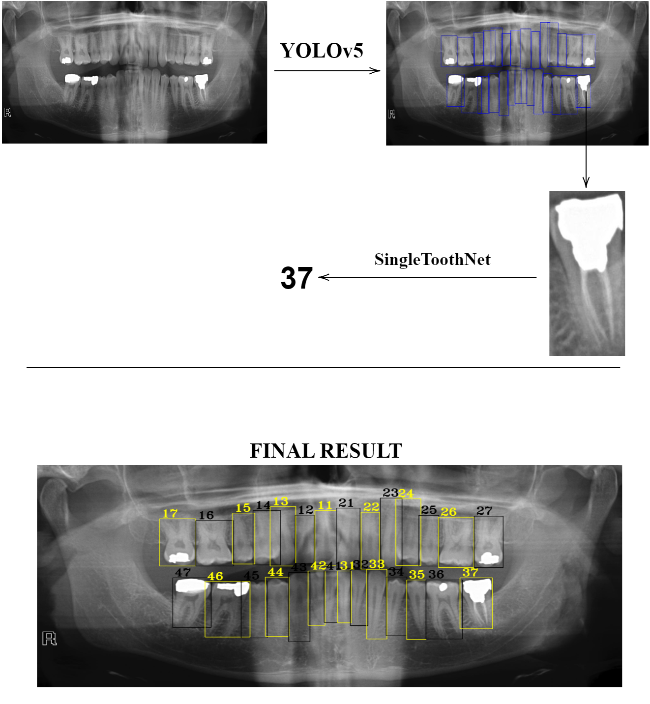

## DATA LABELLING

Every image labelled *(bounding boxes and class names)* with 
labeling tool **Labelimg** and after getting *xml* file for every image it turns into **text** files (for preparing to train with **YOLOv5**).

## DATA
Dataset contains around 180 labelled images of dental x-ray.

## Training
There are **2** models:
1. YOLOv5
2. SingleToothNet

Model **YOLOv5** preticts teeth in the given image and then every predicted tooth becomes a single image and model **SingleToothNet** from this image predicts *number*.

